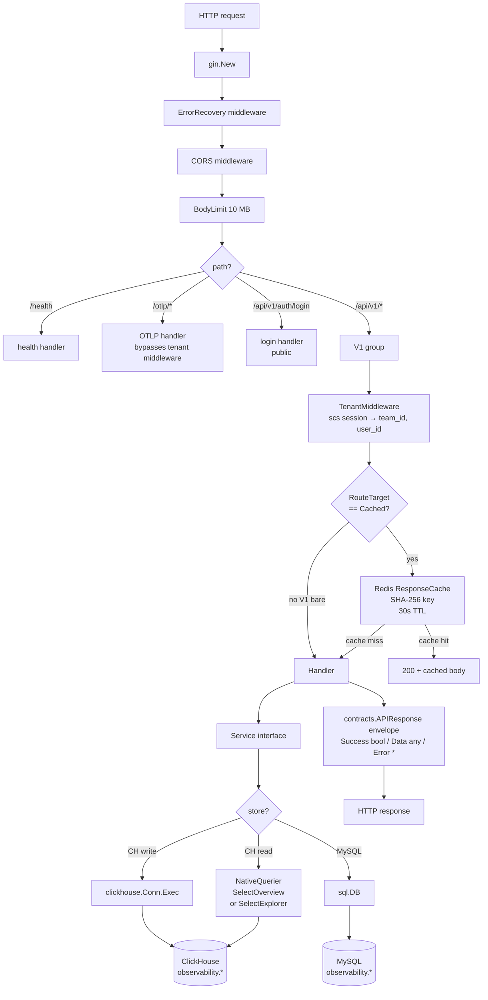
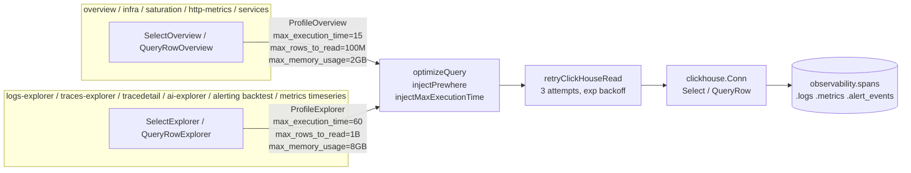
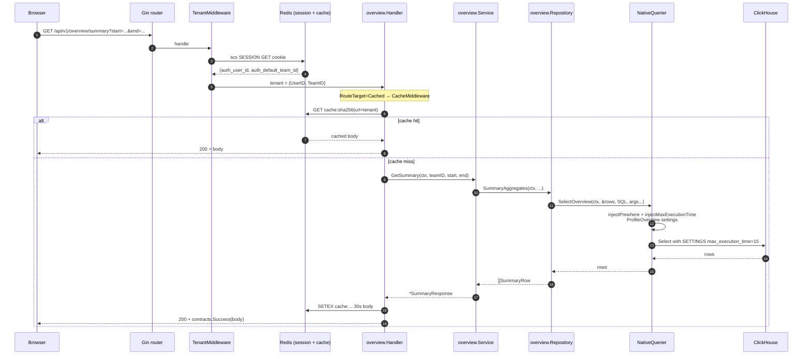
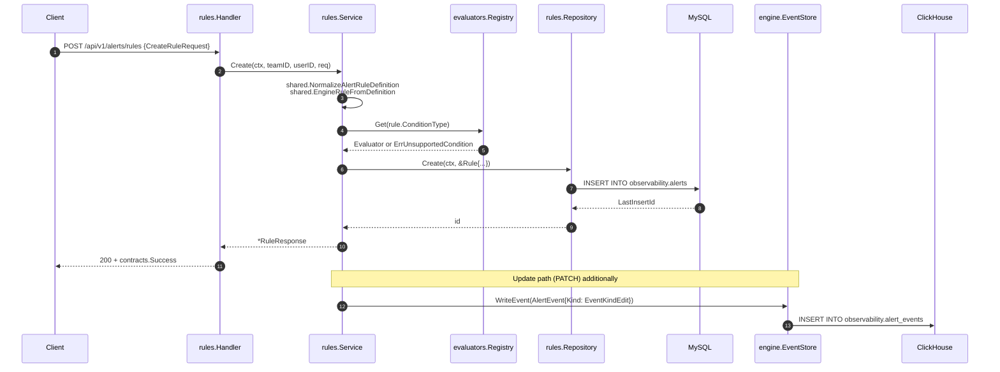
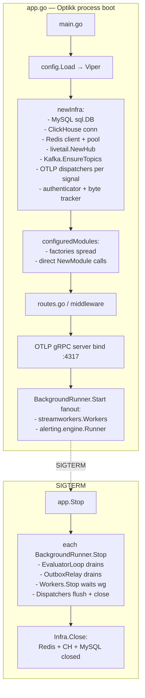

# Optikk backend — Low-Level Design

Three diagrams, each grounded in a specific file path so the reader can jump
from a box to the implementation. Every arrow is exercised by code committed
today — no aspirational state.

Diagrams use **Mermaid** for flows and sequences, **ASCII** for topology.

---

## 1. Ingest path

High-level: OTLP gRPC → per-signal Kafka topic → ack-gated consumer → one
synchronous ClickHouse insert per record → DLQ on flush failure.

### 1.1 Component flow

```mermaid
flowchart LR
    subgraph "External: OTLP agent (collector / SDK)"
        A[OTLP ExportRequest<br/>gRPC :4317]
    end

    subgraph "Optikk pod: gRPC handler"
        B[OTLP handler<br/>internal/ingestion/otlp/]
        C[auth.Authenticator<br/>API-key → team_id<br/>Redis cache + MySQL fallback]
        D[ByteTracker<br/>5-min flush to MySQL<br/>teams.data_ingested_kb]
    end

    subgraph "Kafka producer: per-signal topic"
        E[Dispatcher.Dispatch<br/>kafka_dispatcher.go]
        F[(Kafka topic<br/>optikk.ingest.&lt;signal&gt;)]
        G[(Kafka DLQ<br/>optikk.ingest.&lt;signal&gt;.dlq)]
    end

    subgraph "Kafka consumer: ack-gated"
        H[consumeLoop<br/>DisableAutoCommit]
        I[AckableBatch<br/>Batch + Ack + DedupToken<br/>dedupToken = sha1 record.Value]
        J[Persistence chan<br/>size 512]
        K[Streaming chan<br/>size 512<br/>non-blocking send]
    end

    subgraph "Persistence worker: one per signal"
        L[streamworkers.RunPersistence<br/>workers.go]
        M[CHFlusher.Flush rows, dedupToken<br/>clickhouse.WithSettings<br/>insert_deduplication_token]
        N[(ClickHouse<br/>observability.&lt;signal&gt;)]
    end

    subgraph "Live-tail streaming path: also one goroutine"
        O[Workers.runStreaming]
        P[livetail.Hub.Publish<br/>Redis XADD]
        Q[(Redis Stream<br/>optikk:livetail:&lt;teamID&gt;)]
    end

    A -->|stream request| B
    B --> C
    C -->|teamID| D
    C -->|teamID| E
    E -->|JSON marshal<br/>ProduceSync 2s| F
    F -->|PollFetches<br/>FetchMaxWait 2s| H
    H --> I
    I --> J
    I -.non-blocking fan-out.-> K

    J --> L
    L --> M
    M -->|PrepareBatch<br/>AppendStruct<br/>Send| N
    M -->|success| AckOK[["Ack(nil) → CommitRecords"]]
    M -->|flush error| AckErr[["Ack(err) → Produce to DLQ → CommitRecords"]]
    AckErr --> G

    K --> O
    O --> P
    P --> Q
    Q -->|XREAD BLOCK 2000| WS[WebSocket subscribers<br/>redis_hub.go]

    classDef store fill:#b3e5fc,stroke:#0277bd,stroke-width:1px,color:#000;
    classDef dlq   fill:#ffcdd2,stroke:#c62828,color:#000;
    class F,N,Q store;
    class G dlq;
```



### 1.2 Invariants (Phase 1 — data loss stopped)

| Invariant | Where enforced |
|-----------|-----------------|
| Kafka offset never advances until CH flush resolves | [kafka_dispatcher.go:149-162](/Users/rtayal/obs/optikk-backend/internal/ingestion/kafka_dispatcher.go#L149) — `CommitRecords` only inside the `Ack` closure |
| Flush error produces to DLQ + commits | same file, `produceToDLQ` |
| Redelivered batches collapse to one physical CH insert | [flusher.go](/Users/rtayal/obs/optikk-backend/internal/ingestion/otlp/flusher.go) — `insert_deduplication_token` via `clickhouse.WithSettings` |
| Dedup token is deterministic across redeliveries | `dedupToken = sha1(record.Value)` in `kafka_dispatcher.go` |
| Streaming path is non-blocking | `select { case streaming <- batch; default: }` in `consumeLoop` |

### 1.3 Sequence — happy path (single record)

```mermaid
sequenceDiagram
    autonumber
    participant Agent as OTLP agent
    participant Optikk as OTLP handler
    participant Redis as Redis (auth cache)
    participant MySQL as MySQL (teams)
    participant KProd as Kafka producer
    participant KTopic as Kafka topic
    participant KCons as Kafka consumer
    participant Worker as runPersistence
    participant CH as ClickHouse

    Agent->>Optikk: gRPC Export(log/span/metric)
    Optikk->>Redis: GET auth:api_key
    alt cache miss
        Redis-->>Optikk: nil
        Optikk->>MySQL: SELECT teams WHERE api_key=?
        MySQL-->>Optikk: team_id
        Optikk->>Redis: SETEX auth:api_key 60s team_id
    else cache hit
        Redis-->>Optikk: team_id
    end
    Optikk->>KProd: Dispatch(TelemetryBatch{TeamID, Rows})
    KProd->>KTopic: ProduceSync(record{Value: JSON})
    KTopic-->>KProd: ack (offset N)
    KProd-->>Optikk: nil
    Optikk-->>Agent: OK

    Note over KCons: later — consumer group picks up offset N
    KCons->>KTopic: PollFetches
    KTopic-->>KCons: record(offset N)
    KCons->>Worker: AckableBatch{Batch, Ack, DedupToken}
    Worker->>CH: INSERT INTO observability.&lt;signal&gt;<br/>SETTINGS insert_deduplication_token=sha1
    CH-->>Worker: ok
    Worker->>KCons: Ack(nil)
    KCons->>KTopic: CommitRecords(offset N)
```

### 1.4 Sequence — flush failure path

```mermaid
sequenceDiagram
    autonumber
    participant Worker as runPersistence
    participant Flusher as CHFlusher
    participant CH as ClickHouse
    participant KProd as Kafka producer (DLQ)
    participant KTopic as Kafka consumer
    participant DLQ as &lt;signal&gt;.dlq

    Worker->>Flusher: Flush(rows, dedupToken)
    Flusher->>CH: PrepareBatch / Send
    CH--xFlusher: connection reset
    Flusher-->>Worker: err
    Worker->>KTopic: Ack(err)
    KTopic->>KProd: produceToDLQ(record, reason=err.Error())
    KProd->>DLQ: Produce record + headers<br/>dlq_reason, dlq_source_topic,<br/>dlq_source_partition, dlq_source_offset
    DLQ-->>KProd: ack
    KProd-->>KTopic: ok
    KTopic->>KTopic: CommitRecords(offset)
```

### 1.5 Throughput envelope

| Stage | Current ceiling / pod | Bottleneck |
|-------|------------------------|------------|
| gRPC receive | ~ 20–30 k calls/s | Go net + per-batch auth |
| Dispatcher.Dispatch | ~ 5–10 k batches/s | JSON marshal + sync produce |
| Kafka consume | ~ 100 MB/s | 1 partition per signal today |
| **CHFlusher per signal** | **~ 50 k rows/s** | Single sync goroutine per signal |
| CH write | 200 k rows/s per node | 1 CH node |

See [2026-04-17-capacity-estimate.md](../audits/2026-04-17-capacity-estimate.md) for full math.

---

## 2. Query path

High-level: Gin middleware chain → submodule handler → service → repository →
`NativeQuerier` with explicit profile (Overview / Explorer) → ClickHouse; or
`*sql.DB` → MySQL; response wrapped in the `contracts.APIResponse` envelope.

### 2.1 Middleware + routing



### 2.2 Profile-aware `NativeQuerier` (Phase 4)



Deprecated: `Select` / `QueryRow` forward to Overview for legacy call sites.
See [clickhouse.go](/Users/rtayal/obs/optikk-backend/internal/infra/database/clickhouse.go).

### 2.3 Sequence — `GET /api/v1/overview/summary`



### 2.4 Sequence — `POST /api/v1/alerts/rules` (write path)



### 2.5 Route-to-subpackage map (abbreviated)

| URL pattern | Module file |
|--------------|-------------|
| `GET /overview/*` | [modules/overview/overview](/Users/rtayal/obs/optikk-backend/internal/modules/overview/overview/) — Overview profile |
| `GET /spans/red/*` | [modules/overview/redmetrics](/Users/rtayal/obs/optikk-backend/internal/modules/overview/redmetrics/) — Overview profile |
| `GET /overview/errors/*`, `/errors/groups/*` | [modules/overview/errors](/Users/rtayal/obs/optikk-backend/internal/modules/overview/errors/) — Overview profile |
| `GET /http/*` | [modules/overview/httpmetrics](/Users/rtayal/obs/optikk-backend/internal/modules/overview/httpmetrics/) — Overview profile |
| `POST /explorer/logs/analytics` | [modules/logs/explorer](/Users/rtayal/obs/optikk-backend/internal/modules/logs/explorer/) — Explorer profile |
| `POST /traces/explorer/query` | [modules/traces/explorer](/Users/rtayal/obs/optikk-backend/internal/modules/traces/explorer/) — Explorer profile |
| `GET /traces/:traceId/*` | [modules/traces/tracedetail](/Users/rtayal/obs/optikk-backend/internal/modules/traces/tracedetail/) — Explorer profile |
| `GET /ai/overview/*` | [modules/ai/overview](/Users/rtayal/obs/optikk-backend/internal/modules/ai/overview/) — Overview profile |
| `POST /ai/explorer/query` | [modules/ai/runs](/Users/rtayal/obs/optikk-backend/internal/modules/ai/runs/) + [modules/ai/explorer](/Users/rtayal/obs/optikk-backend/internal/modules/ai/explorer/) — Explorer profile |
| `/alerts/rules/*` | [modules/alerting/rules](/Users/rtayal/obs/optikk-backend/internal/modules/alerting/rules/) |
| `/alerts/incidents`, `/activity`, `/instances/:id/*` | [modules/alerting/incidents](/Users/rtayal/obs/optikk-backend/internal/modules/alerting/incidents/) |
| `/alerts/silences/*` | [modules/alerting/silences](/Users/rtayal/obs/optikk-backend/internal/modules/alerting/silences/) |
| `/alerts/slack/test`, `/callback/slack` | [modules/alerting/slack](/Users/rtayal/obs/optikk-backend/internal/modules/alerting/slack/) |
| `GET /api/v1/ws/live` | [modules/livetail](/Users/rtayal/obs/optikk-backend/internal/modules/livetail/) |

---

## 3. Overall architecture

### 3.1 Topology (ASCII — readable without a renderer)

```
                ┌──────────────────────────────────────────────────────────────────┐
                │                         EXTERNAL / EDGE                          │
                │                                                                  │
     ┌──────────▼─────────┐    ┌─────────────────────┐    ┌─────────────────────┐  │
     │  optikk-frontend   │    │   OTLP agents       │    │  Slack webhook      │  │
     │  (React SPA)       │    │   (SDKs, collector) │    │  (outbound only)    │  │
     └──────────┬─────────┘    └──────────┬──────────┘    └─────────▲──────────┘  │
                │ HTTPS                    │ gRPC + TLS              │ POST         │
                │ /api/v1/*               │ :4317                    │               │
                │ /api/v1/ws/live (WS)    │                          │               │
                ▼                          ▼                          │               │
     ╔══════════════════════════════════════════════════════════════════════════╗    │
     ║                          OPTIKK API POD (horizontal scale)                ║    │
     ║                                                                           ║    │
     ║  ┌──────────────────────────┐   ┌────────────────────────────────────┐   ║    │
     ║  │   Gin HTTP server :19090 │   │   OTLP gRPC server :4317           │   ║    │
     ║  │  - middleware chain      │   │   authenticator → tracker →        │   ║    │
     ║  │  - /api/v1/* modules     │   │   Dispatcher.Dispatch              │   ║    │
     ║  │  - /ws/live WS upgrade   │   │                                    │   ║    │
     ║  │  - /metrics future       │   │                                    │   ║    │
     ║  └───────┬──────────────────┘   └──────────┬─────────────────────────┘   ║    │
     ║          │                                 │                             ║    │
     ║  ┌───────▼──────────────────┐   ┌──────────▼─────────────────────────┐   ║    │
     ║  │  Registered modules      │   │  Ingest dispatcher + producer       │   ║    │
     ║  │  (factory-composed)      │   │  kafka_dispatcher.go                │   ║    │
     ║  │  - alerting/rules        │   │                                     │   ║    │
     ║  │    /incidents /silences  │   └──────────────┬──────────────────────┘   ║    │
     ║  │    /slack /engine BG     │                  │                          ║    │
     ║  │  - ai/overview           │   ┌──────────────▼──────────────────────┐   ║    │
     ║  │    /runs /analytics      │   │  Background runners                  │   ║    │
     ║  │    /explorer             │   │  - streamworkers.Workers (ingest)   │   ║    │
     ║  │  - overview /infra       │   │  - alerting.engine.Runner            │   ║    │
     ║  │  - saturation /logs      │   │      ├── EvaluatorLoop (30s tick)    │   ║    │
     ║  │  - traces /metrics       │   │      ├── Dispatcher (fast path)      │   ║    │
     ║  │  - user/auth etc.        │   │      └── OutboxRelay (durable)       │   ║    │
     ║  └──────────────────────────┘   └──────────────────────────────────────┘   ║    │
     ║                                                                           ║    │
     ╚════╤═════════════╤═════════════╤══════════════╤═══════════════╤══════════╝    │
          │             │             │              │               │              │
          │             │             │              │               │              │
          ▼             ▼             ▼              ▼               ▼              │
     ┌────────┐   ┌──────────┐   ┌─────────┐   ┌──────────┐   ┌──────────────┐     │
     │ MySQL  │   │ClickHouse│   │  Redis  │   │  Kafka   │   │   OTel       │     │
     │        │   │          │   │         │   │(Redpanda)│   │   Collector  │     │
     │teams   │   │spans     │   │sessions │   │.logs     │   │   :14317     │     │
     │users   │   │logs      │   │cache    │   │.spans    │   │     │        │     │
     │alerts  │   │metrics   │   │livetail │   │.metrics  │   │     ▼        │     │
     │alert_  │   │alert_    │   │streams  │   │.*.dlq    │   │   Prometheus │     │
     │ outbox │   │ events   │   │lease    │   │          │   │    :19091    │     │
     │llm_*   │   │          │   │api-key  │   │          │   │              │     │
     └────────┘   └──────────┘   │ cache   │   └──────────┘   └──────────────┘     │
                                 └─────────┘                                        │
                                                                                    │
                                                                                    │
     Not yet wired but provisioned:  Grafana (docker/grafana/provisioning/)        │
     Not yet implemented:            Multi-region cells, sharded flushers,         │
                                     rollup MVs, per-tenant CH concurrency         │
```

### 3.2 Runtime lifecycle



### 3.3 Storage responsibilities

| Store | Owns | Access pattern | Critical failure mode |
|-------|------|----------------|------------------------|
| **MySQL** `observability.*` | Control-plane: teams, users, alerts, alert_outbox, llm_scores, llm_prompts, llm_datasets | Small rows, point lookups, outbox scans with `FOR UPDATE SKIP LOCKED` | Rule CRUD 5xx; evaluator can't write outbox → notifications stall (CH ingest unaffected) |
| **ClickHouse** `observability.spans/.logs/.metrics/.alert_events` | Hot telemetry + append-only audit | Bulk inserts from `CHFlusher`; analytic reads via `NativeQuerier` profiles | Ingest flushes fail → DLQ fills; query endpoints 5xx |
| **Redis** | scs sessions, response cache, api-key auth cache, live-tail streams, alerting lease | Per-request lookups, XADD/XREAD for livetail, SET NX PX for leases | Live tail stops (publish best-effort); alert leases fail-closed = no dispatches until recovery |
| **Kafka/Redpanda** | Durable OTLP ingest queue + DLQ | Producer from API pod, consumer group from same pod | Ingest pipeline stalls; `ProduceSync` errors bubble to OTLP caller |
| **OTel Collector + Prometheus** | Optikk's own metrics (not yet emitted) | Remote-write from collector into Prom | Not in the hot path today — once SDK is wired in `main.go`, collector failure degrades observability but not data plane |

### 3.4 Security / tenancy boundaries

```
Every /api/v1/* request:
    (1) scs session cookie → auth_user_id, auth_default_team_id
    (2) TenantMiddleware attaches tenant{UserID, TeamID} to gin.Context
    (3) Handlers pull tenant via h.GetTenant(c)
    (4) Every repository query carries team_id as a bound param

Every OTLP gRPC call:
    (1) Authenticator.ResolveTeamID(ctx, apiKey) → team_id
    (2) team_id becomes TelemetryBatch.TeamID
    (3) CHFlusher writes team_id on every row
    (4) No cross-tenant reads — every query has team_id = @teamID filter
```

### 3.5 What's shipped vs what's gapped (April 2026 snapshot)

| Area | Shipped (Phases 1–6) | Gapped (ranked in capacity estimate) |
|------|----------------------|---------------------------------------|
| Ingest | AckableBatch + DLQ + dedup token + Redis-only live tail | Sharded flushers, Kafka partitions > 1 per signal |
| Query | Overview / Explorer profiles with distinct CH budgets | Rollup MVs; per-tenant concurrency cap |
| Alerting | Redis lease + MySQL outbox + relay; 5-subpackage decomp | Leased-worker pool (fan-out) for > 500 rules |
| Module layout | alerting/ + ai/ are directory-only parents (shared + subpackages) | — |
| Observability stack | OTel Collector + Prometheus in compose | OTel SDK init in `cmd/server/main.go` (collector has no emitter wired yet) |
| Multi-region | `AppConfig.Region` field exists | Not enforced; tenants not pinned |

---

## Reading order for new contributors

1. **Overall architecture** (section 3) — get the topology.
2. **Ingest path** (section 1) — read [internal/ingestion/](/Users/rtayal/obs/optikk-backend/internal/ingestion/) alongside the sequence diagrams.
3. **Query path** (section 2) — skim one overview module + one explorer module to see both profiles in action:
   - Overview: [internal/modules/overview/redmetrics](/Users/rtayal/obs/optikk-backend/internal/modules/overview/redmetrics/)
   - Explorer: [internal/modules/logs/explorer](/Users/rtayal/obs/optikk-backend/internal/modules/logs/explorer/)
4. **Alerting engine** — the most complex subsystem; read in order: [shared/](/Users/rtayal/obs/optikk-backend/internal/modules/alerting/shared/) (types) → [engine/](/Users/rtayal/obs/optikk-backend/internal/modules/alerting/engine/) (loop + dispatcher + outbox + lease) → [factory/](/Users/rtayal/obs/optikk-backend/internal/modules/alerting/factory/) (composition).
5. **Capacity audit** — [2026-04-17-capacity-estimate.md](../audits/2026-04-17-capacity-estimate.md) for the numbers behind the ceilings in section 1.5.
