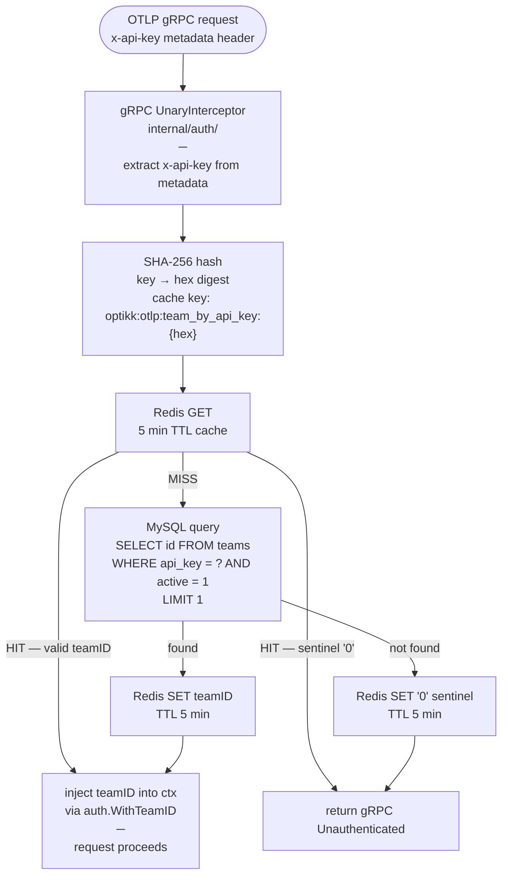
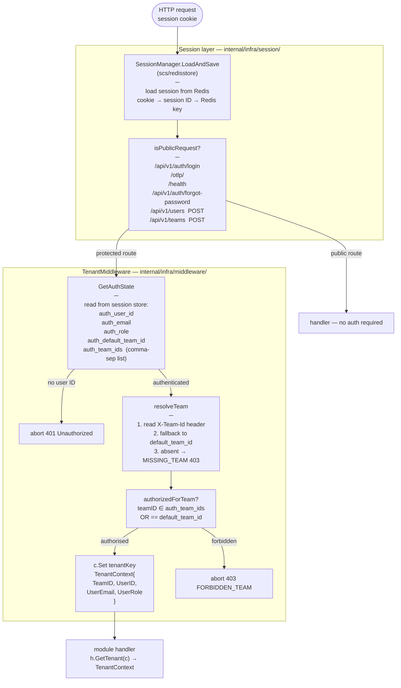
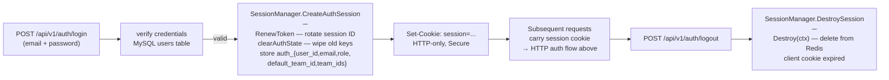

# Authentication Flow

Two distinct auth paths: **gRPC API key** (OTLP ingestion) and **HTTP session** (web UI product APIs).

---

## gRPC — API key auth (OTLP ingestion)

Used by every OTLP export call on port `:4317`.

**Key file:** `internal/auth/resolver.go` — `Authenticator.ResolveTeamID()`

The sentinel `"0"` prevents thundering-herd DB lookups when an invalid key is replayed at ingestion rates (200k+ rps). Invalid keys pay one DB round-trip, then are gate-kept by Redis for 5 minutes.

---

## HTTP — session auth (web UI / product APIs)

Used by every request to `/api/v1/...`.

**Key files:**
- `internal/infra/session/manager.go` — `SessionManager`, `GetAuthState`, `CreateAuthSession`, `DestroySession`
- `internal/infra/middleware/middleware.go` — `TenantMiddleware`, `isPublicRequest`, `resolveTeam`

---

## Session lifecycle

---

## Public route prefixes (no auth required)

| Method | Path prefix |
|--------|-------------|
| ANY | `/api/v1/auth/login` |
| ANY | `/otlp/` |
| ANY | `/health` |
| POST | `/api/v1/auth/forgot-password` |
| POST | `/api/v1/users` |
| POST | `/api/v1/teams` |
