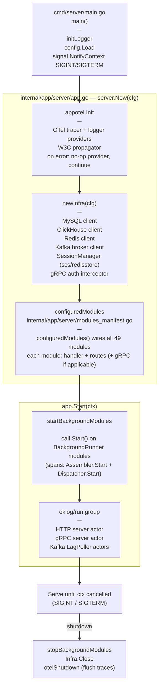
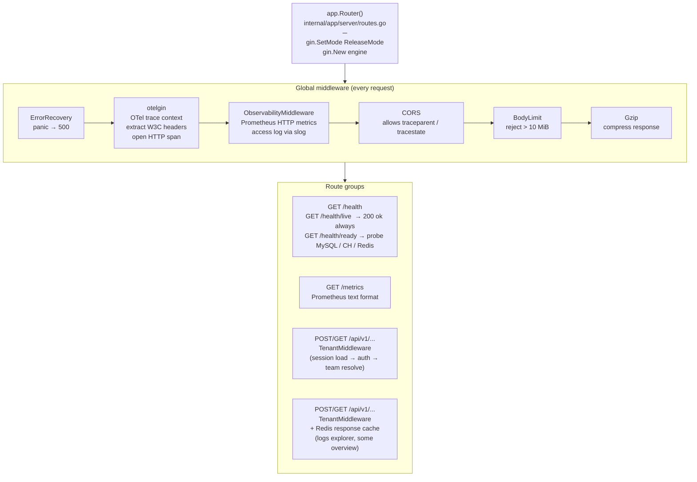
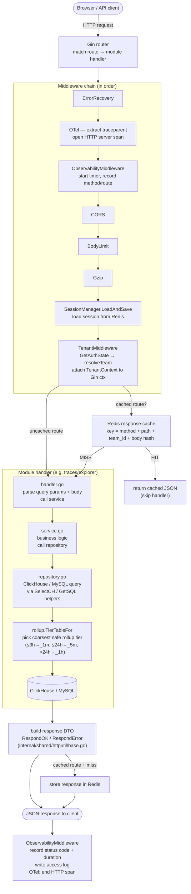

# HTTP Request Lifecycle

Covers application bootstrap and the per-request middleware chain for product API calls.

---

## Application bootstrap

---

## Gin router setup

---

## Per-request flow (product API)

---

## Middleware order reference

| # | Middleware | File |
|---|-----------|------|
| 1 | ErrorRecovery | `internal/infra/middleware/` |
| 2 | OTel (otelgin) | `internal/infra/otel/` |
| 3 | ObservabilityMiddleware | `internal/infra/middleware/observability.go` |
| 4 | CORS | `internal/infra/middleware/` |
| 5 | BodyLimit | `internal/infra/middleware/` |
| 6 | Gzip | standard Gin middleware |
| 7 | SessionManager.Wrap | `internal/infra/session/manager.go` |
| 8 | TenantMiddleware | `internal/infra/middleware/middleware.go` |
| 9 | Redis response cache | `internal/infra/middleware/` (cached group only) |

---

## Health check logic (`/health/ready`)

Probes all three dependencies with a shared 5-second context timeout:

- **MySQL** — `db.PingContext(ctx)`
- **ClickHouse** — `ch.Ping(ctx)`
- **Redis** — `rdb.Ping(ctx)`

Returns `503 Service Unavailable` if any probe fails; `200 {"status":"ok"}` otherwise.

---

## Key response helpers

| Helper | Purpose | File |
|--------|---------|------|
| `RespondOK(c, data)` | 200 JSON `{success:true, data:…}` | `internal/shared/httputil/base.go` |
| `RespondError(c, code, msg)` | 4xx/5xx JSON `{success:false, error:…}` | same |
| `RespondErrorWithCause(c, code, msg, err)` | same + logs cause | same |
| `ParseRequiredRange(c)` | extract + validate `startMs`/`endMs` | same |
| `ParseInt64Param(c, key)` | path/query int64 extraction | same |
| `ParsePageSize(c, def, max)` | bounded pagination size | same |
