# Ingestion Pipeline Flow

End-to-end path from an OTLP export call to ClickHouse storage.
Applies to all three signals (spans, logs, metrics) unless noted.

---

## Overview diagram

```mermaid
flowchart TD
    CLIENT([OTLP SDK / Agent\n:4317 gRPC]) --> HANDLER

    subgraph INGRESS ["ingress/ — per signal"]
        HANDLER["Handler.Export\nhandler.go\n─\nextract teamID from ctx\nrecord mapper_duration metric"]
        HANDLER --> MAPPER["mapper.MapRequest\nmapper.go + signal-specific files\n─\nOTLP protobuf → []Row\nattribute capping + type normalization"]
        MAPPER --> ENRICH["enrich.Enrich\nenrich.go, severity.go\n(spans + logs only)\n─\nseverity resolution\nexception → error promotion"]
        ENRICH --> PRODUCER["producer.Publish\nproducer.go\n─\nproto.MarshalAppend into pooled buffer\npartition key = teamID\npublish via kafka.PublishBatch"]
    end

    PRODUCER --> KAFKA[("Kafka topic\noptikk.ingest.{signal}")]

    subgraph CONSUMER ["consumer/ — generic pipeline (internal/infra/kafka/ingest/)"]
        KAFKA --> DISPATCHER["Dispatcher.PollFetches\ndispatcher.go\n─\nper-partition record routing\nPause at 80% queue depth\nResume at 40% queue depth"]
        DISPATCHER --> WORKER["Worker.Run  (one goroutine per partition)\nworker.go\n─\n100 ms ticker for time-based flush"]
        WORKER --> ACC["Accumulator.Add\naccumulator.go\n─\nFlushSize  : rows ≥ 10 000\nFlushBytes : bytes ≥ 16 MiB\nFlushTime  : age ≥ 250 ms\nFlushStop  : shutdown drain"]
        ACC -->|flush| WRITER
        WRITER["Writer.Write\nwriter.go\n─\nretry loop: up to 5 attempts\nexponential backoff 100 ms → 5 s\n30 s per-attempt timeout"]
    end

    WRITER -->|success| CH_INSERT
    WRITER -->|retry exhausted| DLQ

    subgraph PERSIST ["Storage"]
        CH_INSERT[("ClickHouse\nobservability.{spans,logs,metrics}")]
        DLQ[("Kafka DLQ\noptikk.dlq.{signal}\n─\nx-dlq-reason header\nx-dlq-signal header")]
    end

    CH_INSERT -->|commit offsets| OFFSET["Offset commit\n(franz-go CommitRecords)"]

    CH_INSERT -->|spans only| ASSEMBLER

    subgraph INDEXER ["indexer/ — spans only"]
        ASSEMBLER["Assembler.Observe\nassembler.go\n─\nstate.Upsert(teamID, traceID)\nmergeSpan: count, errors, services, bounds, root fields\nLRU eviction → emit immediately truncated=true"]
        SWEEP["Sweep goroutine\nevery 5 s\n─\nrootSeen + quiet 10 s → emit truncated=false\n60 s hard timeout   → emit truncated=true"]
        ASSEMBLER --> SWEEP
        SWEEP --> EMITTER["CHEmitter.Emit\nemitter.go\n─\nPrepare + Append + Send batch"]
    end

    EMITTER --> TRACES_INDEX[("ClickHouse\nobservability.traces_index\n─\none row per completed / timed-out trace")]
```



---

## Ingress detail

| File | Role |
|------|------|
| `ingress/handler.go` | gRPC export endpoint; validates auth; drives mapper and records `optikk_ingest_mapper_duration`, `mapper_rows_per_request`, `handler_publish_duration` |
| `ingress/producer.go` | Serialises rows with `proto.MarshalAppend`; uses `sync.Pool` scratch buffer; publishes all records for one request in a single `kafka.PublishBatch` call |
| `mapper/mapper.go` | Core OTLP → Row projection; normalises timestamps to `time.Now()` resolved once per request |
| `mapper/mapper_attrs.go` | Spans only — `otlp.TypedAttrs` for deterministic, sort-stable attribute capping into `(str, num, bool, dropped)` buckets |
| `mapper/mapper_status.go` | Spans only — HTTP status code + span error status resolution |
| `mapper/mapper_points.go` | Metrics only — gauge/histogram/sum point expansion |
| `enrich/enrich.go` | Normalises resource fallbacks, collapses zero trace IDs, promotes exception events to error fields |
| `enrich/severity.go` | Maps OTLP severity number → text label (spans + logs) |

---

## Consumer / generic pipeline detail

All config lives under `ingestion.pipeline.{signal}` in `config.yml`.

| Knob | Default | Description |
|------|---------|-------------|
| `max_rows` | 10 000 | Accumulator row-count flush threshold |
| `max_bytes` | 16 MiB | Accumulator byte flush threshold |
| `max_age_ms` | 250 | Accumulator time-based flush interval |
| `worker_queue_size` | 4 096 | Per-partition inbox capacity |
| `pause_depth_ratio` | 0.80 | Pause Kafka partition when queue ≥ 80% |
| `resume_depth_ratio` | 0.40 | Resume when queue ≤ 40% |
| `writer_max_attempts` | 5 | CH insert retry limit |
| `writer_base_backoff_ms` | 100 | Exponential backoff start |
| `writer_max_backoff_ms` | 5 000 | Exponential backoff cap |
| `writer_attempt_timeout_ms` | 30 000 | Per-attempt context timeout |
| `async_insert` | true | Wraps CH insert with `async_insert=1, wait_for_async_insert=1` |

---

## Trace Assembler detail (spans only)

The assembler runs in `internal/ingestion/spans/indexer/`.

```
Observe(span)
  └─ state.Upsert(teamID, traceID)       — O(1) LRU map
       if LRU eviction → emit(truncated=true)
  └─ mergeSpan(pending, span)
       spanCount++
       errorCount++ / errorFp if IsError
       services.add(serviceName)
       peers.add(peerService)
       startMs = min(startMs, span.StartMs)
       endMs   = max(endMs,   span.EndMs)
       if IsRoot: record root_service / root_operation / root_status /
                  root_http_method / root_http_status / environment

Sweep (every 5 s):
  for each pending trace:
    rootSeen AND now - lastSeen ≥ 10 s  → complete  (truncated=false)
    now - firstSeen ≥ 60 s              → time-out  (truncated=true)
  emit → CHEmitter → observability.traces_index

Drain on shutdown:
  Force Sweep with extreme thresholds within 10 s timeout
  Guarantees no in-flight traces are lost on SIGTERM
```

Capacity: 100 000 pending traces. LRU eviction ensures bounded memory even under very long trace windows.

---

## Prometheus metrics (key)

| Metric | Label | What it measures |
|--------|-------|-----------------|
| `optikk_ingest_mapper_duration_seconds` | `signal` | Time to map one OTLP request |
| `optikk_ingest_mapper_rows_per_request` | `signal` | Rows produced per export call |
| `optikk_ingest_handler_publish_duration_seconds` | `signal` | Kafka publish latency |
| `optikk_ingest_worker_queue_depth` | `signal`, `partition` | Inbox backlog per partition |
| `optikk_ingest_worker_flush_duration_seconds` | `signal`, `reason` | Time to flush a batch |
| `optikk_ingest_writer_ch_insert_duration_seconds` | `signal` | ClickHouse insert latency |
| `optikk_ingest_writer_dlq_sent_total` | `signal` | Records sent to DLQ |
| `optikk_ingest_worker_paused_partitions` | `signal` | Paused partition count |
| `optikk_ingest_mapper_attrs_dropped_total` | `signal` | Attributes dropped by capping |
