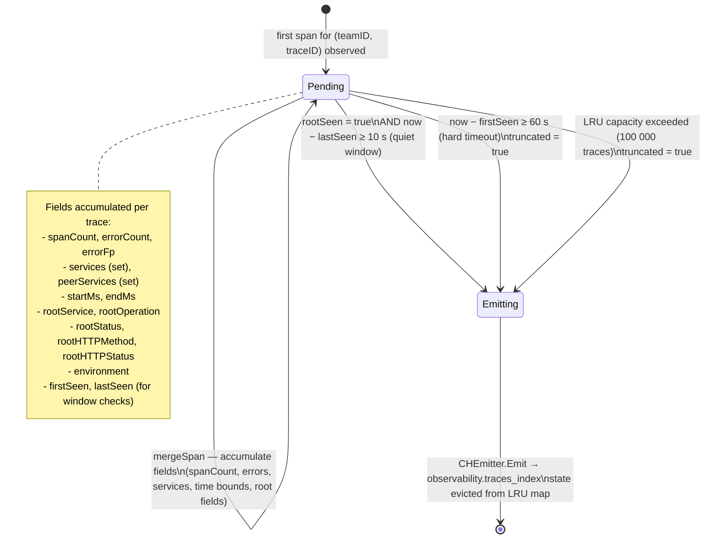
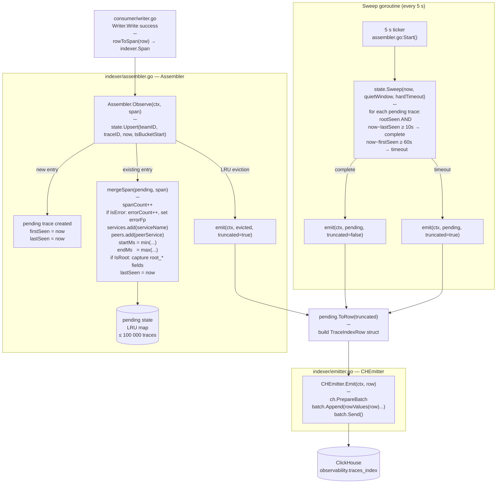

# Trace Assembly Flow

The Trace Assembler is a spans-only background component that aggregates raw span writes into a single summary row per trace in `observability.traces_index`.

**Location:** `internal/ingestion/spans/indexer/`

---

## Why it exists

ClickHouse `observability.spans` stores every span row individually. The traces explorer (`/api/v1/traces/query`) needs per-trace aggregates — service set, error count, root operation, duration — without scanning millions of span rows on every query. The assembler materialises these aggregates incrementally at ingest time and writes them to `observability.traces_index` (one row per trace).

---

## State machine diagram



---

## Component flow



---

## TraceIndexRow columns

| Column | Type | Source |
|--------|------|--------|
| `team_id` | UInt32 | from span |
| `ts_bucket_start` | UInt64 | earliest bucket seen |
| `trace_id` | String | from span |
| `start_ms` | Int64 | min of all span start times |
| `end_ms` | Int64 | max of all span end times |
| `duration_ns` | Int64 | `(end_ms − start_ms) × 1e6` |
| `root_service` | String | root span `service.name` |
| `root_operation` | String | root span name |
| `root_status` | String | root span status code |
| `root_http_method` | String | root span HTTP method |
| `root_http_status` | UInt16 | root span HTTP status |
| `span_count` | Int64 | total spans seen |
| `has_error` | Bool | `errorCount > 0` |
| `error_count` | Int64 | spans with error status |
| `service_set` | Array(String) | unique services in trace |
| `peer_service_set` | Array(String) | unique peer services |
| `error_fp` | String | first error fingerprint |
| `environment` | String | `deployment.environment` attribute |
| `truncated` | Bool | true if hard-timeout or LRU eviction |
| `last_seen_ms` | Int64 | unix ms of last span seen |

---

## Configuration

```yaml
# internal/ingestion/spans/indexer/ defaults (assembler.go)
capacity:      100_000   # max pending traces in LRU
quiet_window:  10s       # idle time after root span → emit
hard_timeout:  60s       # max wait before forced emit
sweep_every:   5s        # sweep loop interval
```

---

## Shutdown drain

When the application receives SIGTERM, the assembler's `Stop()` is called:

```
assembler.Stop()
  → cancel ticker ctx
  → drain(ctx, 10 s timeout)
       state.Sweep(now + 1h, quietWindow=0, hardTimeout=0)
       forces ALL pending traces to complete immediately
       emits every remaining trace within the 10 s deadline
```

This guarantees no in-flight traces are silently lost on a graceful restart.

---

## Read path

`observability.traces_index` is queried by:

- `internal/modules/traces/explorer/repository.go` — `ListTraces`, `GetTrace`
- `internal/modules/traces/trace_suggest/repository.go` — DSL autocomplete

All readers use `internal/modules/traces/shared/traceidmatch/` (`WhereTraceIDMatchesCH`) for consistent `trace_id` predicate normalisation.
