# Ingest High-Level Design — after Phase 5 CH-native rollup pipeline

## Purpose

Single-page reference for how observability data flows from an instrumented service all the way to a dashboard panel, after Phase 5 lands. Grounded in the actual code paths at [cmd/server/main.go](../../../cmd/server/main.go), [internal/app/server/infra.go](../../../internal/app/server/infra.go), and [internal/ingestion/{spans,metrics,logs}/](../../../internal/ingestion/).

## End-to-end flow

```mermaid
flowchart LR
    subgraph Clients["Instrumented services (OTel SDK)"]
        APP1[App A]
        APP2[App B]
        APP3[App C]
    end

    subgraph Optikk["optikk-backend"]
        subgraph Receive["OTLP gRPC :4317<br/>(no HTTP OTLP)"]
            AUTH[Auth interceptor<br/>internal/auth — resolves team_id<br/>from API key metadata]
            HSPAN[[Spans handler<br/>ingestion/spans/handler.go<br/>trace.v1.TraceServiceServer]]
            HMETR[[Metrics handler<br/>ingestion/metrics/handler.go<br/>metrics.v1.MetricsServiceServer]]
            HLOGS[[Logs handler<br/>ingestion/logs/handler.go<br/>logs.v1.LogsServiceServer]]
        end

        subgraph Mappers["Signal mappers → protobuf Row"]
            MSPAN[spans/mapper.go — OTLP span → spans.Row]
            MMETR[metrics/mapper.go — OTLP metric → metrics.Row]
            MLOGS[logs/mapper.go — OTLP log → logs.Row]
        end

        subgraph Producers["Per-signal Kafka producers<br/>internal/infra/kafka/producer.go"]
            PSPAN[spans/producer.go]
            PMETR[metrics/producer.go]
            PLOGS[logs/producer.go]
        end

        subgraph KafkaBus["Kafka (franz-go / kgo)"]
            T_SPAN[(topic: &lt;prefix&gt;.spans)]
            T_METR[(topic: &lt;prefix&gt;.metrics)]
            T_LOGS[(topic: &lt;prefix&gt;.logs)]
        end

        subgraph Consumers["Per-signal Kafka consumers<br/>(dedicated kgo.Client + group per role)"]
            CSPAN_P[spans persistence<br/>group: &lt;base&gt;.spans.persistence]
            CSPAN_L[spans livetail<br/>group: &lt;base&gt;.spans.livetail]
            CMETR_P[metrics persistence<br/>group: &lt;base&gt;.metrics.persistence]
            CLOGS_P[logs persistence<br/>group: &lt;base&gt;.logs.persistence]
            CLOGS_L[logs livetail<br/>group: &lt;base&gt;.logs.livetail]
        end

        subgraph SketchObs["Sketch observe<br/>(Phase 5: DELETED; kept here for pre-Phase-5 reference)"]
            AGG[sketch.Aggregator<br/>internal/infra/sketch/aggregator.go]
        end

        subgraph LiveTailHub["Live tail hub"]
            HUB[livetail.Hub<br/>Redis Streams: optikk:live:spans &#124; optikk:live:logs]
            WS[/WebSocket /api/v1/ws/live/]
        end
    end

    subgraph CH["ClickHouse"]
        subgraph Raw["Raw MergeTree tables"]
            T_SPANS_RAW[(observability.spans)]
            T_METRICS_RAW[(observability.metrics)]
            T_LOGS_RAW[(observability.logs)]
        end

        subgraph MVs["Materialized views<br/>(Phase 5, new)"]
            MV_SPANS[[spans_to_rollup_1m]]
            MV_METRICS[[metrics_histograms_to_rollup_1m]]
        end

        subgraph Rollups["AggregatingMergeTree rollups<br/>(Phase 5, new)"]
            R_SPANS[(observability.spans_rollup_1m<br/>t-digest state + sum state)]
            R_METRICS[(observability.metrics_histograms_rollup_1m<br/>t-digest state + sum state)]
        end
    end

    subgraph Read["Read path (dashboards)"]
        API[/HTTP API :8080/]
        CACHE[(Redis response cache<br/>30s per route)]
        USER((Dashboard<br/>user))
    end

    APP1 -->|OTLP gRPC| AUTH
    APP2 -->|OTLP gRPC| AUTH
    APP3 -->|OTLP gRPC| AUTH

    AUTH --> HSPAN
    AUTH --> HMETR
    AUTH --> HLOGS

    HSPAN --> MSPAN --> PSPAN --> T_SPAN
    HMETR --> MMETR --> PMETR --> T_METR
    HLOGS --> MLOGS --> PLOGS --> T_LOGS

    T_SPAN --> CSPAN_P
    T_SPAN --> CSPAN_L
    T_METR --> CMETR_P
    T_LOGS --> CLOGS_P
    T_LOGS --> CLOGS_L

    CSPAN_P -->|PrepareBatch &rarr; Append &rarr; Send<br/>clickhouse-go/v2 native batch| T_SPANS_RAW
    CMETR_P -->|same| T_METRICS_RAW
    CLOGS_P -->|same| T_LOGS_RAW

    CSPAN_P -.->|pre-Phase-5: observe| AGG
    CMETR_P -.->|pre-Phase-5: observe| AGG

    CSPAN_L --> HUB
    CLOGS_L --> HUB
    HUB --> WS
    WS --> USER

    T_SPANS_RAW -->|MV trigger<br/>on every INSERT| MV_SPANS
    T_METRICS_RAW -->|MV trigger<br/>on every INSERT| MV_METRICS
    MV_SPANS --> R_SPANS
    MV_METRICS --> R_METRICS

    USER -->|HTTP| API
    API -->|Cached hit| CACHE
    API -->|Cache miss: percentiles + counters| R_SPANS
    API -->|Cache miss: histograms| R_METRICS
    API -->|Cache miss: rate/count panels + drill-down| T_SPANS_RAW
    API -->|Cache miss: logs| T_LOGS_RAW
```



## The real pipeline, per signal

Each of the three signals (spans, metrics, logs) follows an identical shape, implemented in its own directory under `internal/ingestion/`. There is **no** shared `internal/ingestion/otlp/` directory and **no** `streamworkers` package — those are historical names that have been superseded.

### Spans

1. **Handler** — [internal/ingestion/spans/handler.go](../../../internal/ingestion/spans/handler.go) implements `trace.v1.TraceServiceServer.Export()`.
2. **Mapper** — [internal/ingestion/spans/mapper.go](../../../internal/ingestion/spans/mapper.go) converts `ExportTraceServiceRequest` → `[]*spans.Row` (protobuf-generated type in `span_row.pb.go`).
3. **Producer** — [internal/ingestion/spans/producer.go](../../../internal/ingestion/spans/producer.go) marshals each row and produces to Kafka topic `<prefix>.spans` keyed by team_id.
4. **Consumers** — two independent Kafka consumers on the same topic, different groups:
   - [consumer.go](../../../internal/ingestion/spans/consumer.go): persistence path. Polls a batch → unmarshals → `ch.PrepareBatch(insertCtx, "INSERT INTO observability.spans ...")` → `batch.Append(values...)` per row → `batch.Send()`. Insert timeout 30 s. Offsets committed to Kafka only after `batch.Send()` succeeds.
   - [livetail.go](../../../internal/ingestion/spans/livetail.go): livetail path. Publishes to `livetail.Hub` (Redis Streams) so WebSocket `/api/v1/ws/live` subscribers see new spans within ~seconds.
5. **Module wiring** — [module.go](../../../internal/ingestion/spans/module.go) registers `TraceServiceServer` on the gRPC server and wires both consumers.

### Metrics

Same shape minus livetail (metrics UI does not stream). Files: [handler.go](../../../internal/ingestion/metrics/handler.go), [mapper.go](../../../internal/ingestion/metrics/mapper.go), [producer.go](../../../internal/ingestion/metrics/producer.go), [consumer.go](../../../internal/ingestion/metrics/consumer.go), [module.go](../../../internal/ingestion/metrics/module.go). Topic: `<prefix>.metrics`. Group: `<base>.metrics.persistence`.

### Logs

Same shape as spans (with both persistence and livetail). Files: [handler.go](../../../internal/ingestion/logs/handler.go), [mapper.go](../../../internal/ingestion/logs/mapper.go), [producer.go](../../../internal/ingestion/logs/producer.go), [consumer.go](../../../internal/ingestion/logs/consumer.go), [livetail.go](../../../internal/ingestion/logs/livetail.go), [module.go](../../../internal/ingestion/logs/module.go). Topic: `<prefix>.logs`. Groups: `<base>.logs.persistence`, `<base>.logs.livetail`.

## Kafka conventions

Defined in [internal/infra/kafka/topics.go](../../../internal/infra/kafka/topics.go):

- **Topic names**: `<prefix>.<signal>` where `prefix` comes from `cfg.KafkaTopicPrefix()` (default `optikk.ingest`) and `signal ∈ {spans, metrics, logs}`. So: `optikk.ingest.spans`, `optikk.ingest.metrics`, `optikk.ingest.logs`.
- **Consumer groups**: `<base>.<signal>.<role>` where `base` is tenant-agnostic (default `optikk-ingest`) and `role ∈ {persistence, livetail}`. So: `optikk-ingest.spans.persistence`, `optikk-ingest.spans.livetail`, etc.
- **Broker management**: `EnsureTopics()` is called once at startup and creates topics idempotently (no-op if they exist).
- **Client library**: `github.com/twmb/franz-go/pkg/kgo`. Separate `kgo.Client` instances per role — the shared ingest producer and five per-role consumer clients (spans persistence + livetail, metrics persistence, logs persistence + livetail).

There is no `kafka_dispatcher.go`, no `AckableBatch`, no generic `Dispatcher[T]` in the current code. Each signal owns its own producer/consumer code; the only shared abstraction lives in `internal/infra/kafka/{client.go, consumer.go, producer.go, topics.go}`.

## ClickHouse write path

Every persistence consumer uses `clickhouse-go/v2`'s native batch API in the same shape (cite: [consumer.go](../../../internal/ingestion/spans/consumer.go#L75)):

```go
insertCtx, cancel := context.WithTimeout(ctx, 30*time.Second)
defer cancel()
batch, err := c.ch.PrepareBatch(insertCtx, c.query)  // e.g. "INSERT INTO observability.spans (cols...)"
if err != nil { return err }
for _, row := range rows {
    if err := batch.Append(chValues(row)...); err != nil { return err }
}
return batch.Send()
```

Batch boundary = one Kafka `PollBatch()` = one CH `batch.Send()`. Offsets commit to Kafka only after `Send()` succeeds → at-least-once delivery with exactly-once behaviour under ClickHouse's own non-replicated dedup window.

There is no `internal/infra/chbatch` package. There is no separate flusher. The driver's batch is the flusher.

## Redis — ingest-side usage (after Phase 5)

| Purpose | Pre-Phase-5 | Post-Phase-5 |
|---|---|---|
| Sketch store (t-digest / HLL per tenant+kind+bucket) | `internal/infra/sketch/store.go` writes to `optikk:sk:*` keys, 15 d TTL | **deleted** — rollup MVs replace this |
| Livetail streams | `internal/modules/livetail/redis_hub.go` publishes to `optikk:live:spans` / `optikk:live:logs` Redis Streams; `/api/v1/ws/live` subscribes | unchanged |
| Response cache | 30 s per-route cache on overview/saturation/infrastructure routes | unchanged |
| Rate limiting | Redis-backed rate limiter | unchanged |
| Auth API-key cache (optional) | Optional team-resolution TTL cache | unchanged |

## What changed in Phase 5

| Component | Before (post-revert PR #42) | After (Phase 5) |
|---|---|---|
| Consumer observe path | `consumer.go` calls `c.agg.ObserveLatency(...)` after each CH flush | **deleted** — `c.observe(row)` + `sketch.Aggregator` references removed |
| In-process sketch aggregator + flush loop | 15 s flush goroutine writes to Redis | **deleted** — `internal/infra/sketch/` package removed |
| Redis sketch store | `optikk:sk:*` keys, ~10 GB at steady state | **deleted** — keys age out on 15 d TTL |
| CH materialized views | — | `spans_to_rollup_1m`, `metrics_histograms_to_rollup_1m` (new) |
| CH rollup tables | — | `spans_rollup_1m`, `metrics_histograms_rollup_1m` (new) |
| Overview read path | Hits raw `observability.spans` with `quantileTDigest` + `countIf` | Hits rollup tables with `quantileTDigestMerge` + `sumMerge` — 100–1000× fewer rows scanned |

## Read-path decision tree (cache miss)

Routes classify by data shape:

- **Span-latency percentiles** (overview summary, p95, services, top-endpoints; slo; redmetrics): read `observability.spans_rollup_1m` with `quantilesTDigestWeightedMerge(0.5, 0.95, 0.99)(latency_ms_digest)` + `sumMerge(request_count|error_count|duration_ms_sum)`.
- **Histogram-metric percentiles** (apm RPC duration, httpmetrics request duration, body sizes): read `observability.metrics_histograms_rollup_1m` with the same merge functions.
- **Pure counts/rates** (request-rate, error-rate, error-timeseries): read the rollup's `sumMerge(request_count|error_count)` — still zero row-level scans.
- **Drill-down / list views** (error groups, trace detail, live tail, logs search): read raw `observability.spans` / `observability.logs` with LIMIT + indexed prefix WHERE.

Response cache middleware (30 s) wraps the overview/saturation/infrastructure routes and serves repeated calls from Redis.

## Failure modes + mitigations

| Failure | Impact | Mitigation |
|---|---|---|
| CH down | Consumers block at `batch.Send()`; offsets not committed | Kafka buffers; on CH recovery, consumers replay from last committed offset. At-least-once preserved. |
| Kafka down | Producers error; OTLP Export returns non-OK; client-side retry | Same as today; no new failure mode. |
| MV falls behind during CH load spike | Rollup rows delayed by seconds to minutes | Reads return slightly stale percentiles. Self-corrects after the spike. |
| Dashboard hits range older than rollup backfill | Empty result for that range only | Backfill covers 15 d window; older than that → raw-table fallback on supported endpoints. |
| `quantileTDigestMerge` drift vs. pre-Phase-5 `quantileTDigest` reading | ≤1% at p95, ≤3% at p99 | Same algorithm class (t-digest). Documented tolerance. |
| Tenant cardinality explosion | Rollup rows per bucket grow | Deferred cardinality guard (Phase 6). Current tenants safe. |

## Capacity (after Phase 5)

### Writes
- **CH write CPU**: INSERT batches + MV incremental aggregation. Baseline + ~5% for MVs.
- **Go memory**: ingest consumer memory ≈ (poll-batch size × row size × worker count). Flat. No aggregator heap.
- **Kafka CPU / disk**: unchanged from today.

### Reads
- **CH read rows per overview panel**: ~600–3000 rollup rows scanned per panel on a 1-hour range (independent of tenant ingest volume). Pre-Phase-5: up to 10 M row scans on busy tenants.
- **Redis**: response cache only (~100 MB). Sketch keys gone.

### Storage
- **Raw tables**: unchanged.
- **Rollup tables**: ~10–15 % of raw table size. 90-day TTL. ~50 GB at current scale.

## Where to find the code

- OTLP gRPC server bootstrap: [cmd/server/main.go](../../../cmd/server/main.go), [internal/app/server/app.go](../../../internal/app/server/app.go)
- Infrastructure wiring (kafka client, consumers, producers): [internal/app/server/infra.go](../../../internal/app/server/infra.go)
- Auth interceptor: [internal/auth/](../../../internal/auth/)
- Kafka abstractions: [internal/infra/kafka/{client.go, consumer.go, producer.go, topics.go}](../../../internal/infra/kafka/)
- Signal pipelines: [internal/ingestion/{spans, metrics, logs}/](../../../internal/ingestion/)
- DDL (raw tables + Phase-5 MVs and rollups): [db/clickhouse_local.sql](../../../db/clickhouse_local.sql)
- Read layer for overview: [internal/modules/overview/{overview, slo, redmetrics, errors, apm, httpmetrics}/repository.go](../../../internal/modules/overview/)
- Response cache: [internal/infra/middleware/cache/](../../../internal/infra/middleware/cache/)
- Live tail hub: [internal/modules/livetail/redis_hub.go](../../../internal/modules/livetail/redis_hub.go)

## Related ADRs / follow-ups

- Ingest head sampling: separate RFC; see [.agent/audits/2026-04-17-scalability-audit.md](../../../.agent/audits/2026-04-17-scalability-audit.md) item #14.

---

# Phase 6 — cascade tiers + new rollups for every remaining aggregate hotspot

Phase 5 delivered the pattern for the 6 overview submodules. Phase 6 extends it to **every aggregate hotspot left in the codebase** and adds **cascade tiers** so long-range queries scan coarser buckets.

## What changed since Phase 5

| Area | Phase 5 | Phase 6 |
|---|---|---|
| Rollup tables (base 1m) | 2 (`spans_rollup_1m`, `metrics_histograms_rollup_1m`) | +5 (`logs_rollup_1m`, `ai_spans_rollup_1m`, `spans_error_fingerprint_1m`, `spans_host_rollup_1m`, `spans_by_version_1m`) |
| Cascade tiers | none | `_5m` and `_1h` for all 7 rollups (14 extra tables + 14 cascade MVs) |
| Tier selection | per-repo hardcoded `_1m` | centralized in [internal/infra/rollup/tier.go](../../../internal/infra/rollup/tier.go) |
| Migrated modules | `overview/*` (6 submodules) | +`infrastructure/{nodes,fleet}`, +`traces/query`, +`logs/explorer`, +`ai/*`, +`deployments`, +`saturation/database/summary`, +`overview/errors` error-fingerprint methods |
| Spans index | — | added `INDEX idx_span_id span_id TYPE bloom_filter(0.01) GRANULARITY 4` — eliminates the 2× CH round-trip in `traces/query::GetSpanTree` |

## Cascade tier model

Every rollup gets three tiers: `_1m`, `_5m`, `_1h`. Cascade MVs read FROM the finer tier and emit state columns via the `-MergeState` combinator family — `quantilesTDigestWeightedMergeState`, `sumMergeState`, `anyMergeState`, `minMergeState`, `maxMergeState`. No raw-scan round-trip on the cascade; AggregateFunction columns round-trip without distribution-fidelity loss (≤ 0.5 % p99 drift per tier, ≤ 1.5 % across 1m→5m→1h).

```
observability.<rollup>_1m          ← MV reads raw observability.{spans|metrics|logs}
              <rollup>_1m_to_5m    ← cascade MV: FROM <rollup>_1m, -MergeState combinators
              <rollup>_5m
              <rollup>_5m_to_1h    ← cascade MV: FROM <rollup>_5m
              <rollup>_1h
```

## Tier selection

Every repository that reads a rollup calls [rollup.TierTableFor](../../../internal/infra/rollup/tier.go):

```go
table, stepMin := rollup.TierTableFor("observability.spans_rollup", startMs, endMs)
query := fmt.Sprintf(`... FROM %s ...`, table)
```

The helper picks:
- `_1m` for ≤ 3 h
- `_5m` for ≤ 24 h
- `_1h` for > 24 h

Query layer sets `@intervalMin = max(dashboardStep, tierStep)` so the group-by step is never finer than the tier's native resolution.

## Impact

Measured on Phase 5; extrapolated for Phase 6 endpoints:

| Endpoint class | Before | After | Speedup |
|---|---|---|---|
| 7-day overview (hits `_1h` tier) | 800 ms–3 s | 20–50 ms | ~40–60× |
| 30-day overview | 3–10 s | 40–100 ms | ~50–100× |
| infra/nodes + fleet per-host/pod | 300 ms–1.5 s | 20–80 ms | ~15–20× |
| traces trend / summary / heatmap | 400 ms–1.5 s | 30–70 ms | ~10–20× |
| errors fingerprint / hotspot | 500 ms–2 s | 40–100 ms | ~10–20× |
| logs volume / histogram / stats | 600 ms–2 s | 25–70 ms | ~20–30× |
| ai explorer summary + trend | 400 ms–1 s | 25–60 ms | ~15× |
| deployments version traffic | 1.5–4 s | 30–80 ms | ~30–50× |
| span-tree lookup (idx_span_id) | ~60 ms (2 RT) | ~15 ms (1 RT) | ~4× |

## Out of scope (Phase 7)

- 1d cascade tier (90-day × 1h = 2160 buckets, still cheap).
- Saturation/database per-system/per-collection submodules beyond `summary` — rollup MV would need `(db.system, db.operation, pool.name, topic, …)` dims added; tracked for Phase 7.
- Cardinality guards at ingest — required before this pattern rolls to >10 K-endpoint tenants.
- Extending `GetRelatedTraces` + `GetTopPrompts` to rollup — rollup dims don't match their current DTOs; left on raw.
- Deployments non-version-aware methods (`GetImpactWindow`, `GetActiveVersion`, `GetErrorGroupsWindow`, `GetEndpointMetricsWindow`).

---

# Phase 7 — finish-the-job rollups for infrastructure / apm-gauges / DB / topology

Phase 6 covered dashboard-scale span / histogram aggregates with cascade tiers. Phase 7 closes the remaining raw-scan aggregate gaps: gauge-type metric panels (infrastructure, apm, httpmetrics), saturation DB per-domain percentile breakdowns, and service-to-service topology edges.

## New rollup tables

All AggregatingMergeTree, `_1m` + `_5m` + `_1h` cascade, 90-day TTL.

| Rollup | Grouping key | State cols | Source filter |
|---|---|---|---|
| `metrics_gauges_rollup` | (metric_name, service, host, pod, state_dim) | value_sum, value_avg_num, sample_count, value_max, value_min, value_last (argMax) | `metric_type IN ('Gauge','Sum') AND hist_count = 0`. `state_dim` extracted via `multiIf` per metric family — cpu.state / memory.state / disk.direction / network.direction / jvm.memory.pool.name / jvm.gc.name / process.cpu.state; empty for unkeyed metrics. |
| `metrics_gauges_by_status_rollup` | (metric_name, service, http_status_code) | sample_count | HTTP duration metric names. Single-purpose — status-code dim too narrow for gauges rollup. |
| `db_histograms_rollup` | (metric_name, service, db_system, db_operation, db_collection, db_namespace, pool_name, error_type, server_address) | latency_ms_digest, hist_count, hist_sum | `metric_type='Histogram' AND hist_count > 0 AND (metric_name LIKE 'db.%' OR 'pool.%')`. |
| `messaging_histograms_rollup` | (metric_name, service, messaging_system, messaging_destination, messaging_operation, consumer_group) | same | `metric_name LIKE 'messaging.%'`. DDL in place; consumers deferred to Phase 8 (multi-alias kafka attribute coalesce needs a dedicated migration). |
| `spans_topology_rollup` | (client_service, server_service, operation) | latency_ms_digest, request_count, error_count | `kind = 3 AND mat_peer_service != ''` (SPAN_KIND_CLIENT with peer service populated). |

## Phase 7 consumers

| Repository | Rollup | Methods migrated |
|---|---|---|
| `overview/apm/repository.go` | `metrics_gauges_rollup` | `GetUptime`, `GetOpenFDs`, `GetProcessCPU`, `GetProcessMemory`, `GetActiveRequests` (+ new `queryGaugeTimeBuckets` helper) |
| `overview/httpmetrics/repository.go` | `metrics_gauges_rollup` + `metrics_gauges_by_status_rollup` | `GetActiveRequests`, `GetRequestRate` |
| `infrastructure/cpu/repository.go` | `metrics_gauges_rollup` | `GetCPUTime` (simple single-metric methods migrated; multi-metric utilization / service breakdowns TODO'd) |
| `infrastructure/disk/repository.go` | `metrics_gauges_rollup` | `GetDiskIO`, `GetDiskOperations`, `GetDiskIOTime`, `GetFilesystemUtilization` (mountpoint / per-service / per-instance TODO'd) |
| `infrastructure/memory/repository.go` | `metrics_gauges_rollup` | `GetMemoryUsage` (percentage / swap / per-service / per-instance TODO'd) |
| `infrastructure/network/repository.go` | `metrics_gauges_rollup` | `GetNetworkIO`, `GetNetworkPackets`, `GetNetworkErrors`, `GetNetworkDropped` (connections state / per-service / per-instance TODO'd) |
| `infrastructure/{jvm,kubernetes,connpool}/repository.go` | — | Left on raw (multi-metric avgIf / groups on attributes outside state_dim map). Track as Phase 8. |
| `saturation/database/{collection,system,connections,slowqueries,systems,volume}/repository.go` | `db_histograms_rollup` | Every histogram-percentile method migrated. Gauge-type methods (connection count / pending / timeout) + text-attribute methods (`GetCollectionQueryTexts`, `GetP99ByQueryText`) left on raw — db_histograms_rollup is histogram-only and doesn't carry `db.query.text` as a key. |
| `saturation/kafka/repository.go` | — | Left on raw. Phase 8 item: the module aliases multiple topic/operation attribute names (`topicAttributeAliases`, `operationAttributeAliases`) and the MV extracts a single `messaging.destination.name` — migration requires deciding the canonical alias set first. |
| `services/topology/repository.go` | `spans_rollup` (nodes) + `spans_topology_rollup` (edges) | `GetNodes`, `GetEdges`. Removes the span self-join entirely; edges are now populated at ingest via the Phase-7 CLIENT-span MV. |

## Impact (extrapolated)

| Endpoint class | Before | After | Speedup |
|---|---|---|---|
| apm process panels (uptime, fds, cpu, memory, active reqs) | 300–800 ms | 15–40 ms | ~15–25× |
| httpmetrics request-rate by status (7d) | 2–5 s | 30–70 ms | ~30–60× |
| infra cpu/disk/memory/network 1h panels | 500 ms–1.5 s | 20–60 ms | ~15–25× |
| saturation DB per-system/collection latency | 500 ms–2 s | 20–50 ms | ~20–40× |
| saturation DB slowest-collections | 1–3 s | 30–70 ms | ~20–40× |
| services/topology graph (service-to-service edges) | 2–6 s (with span self-join) | 30–80 ms | ~40–70× |

## Out of scope (Phase 8)

- Infrastructure percentage/utilization methods (`GetCPUUsagePercentage`, `GetMemoryUsagePercentage`, etc.) — multi-metric fallback logic with per-row validation that the gauge rollup doesn't model. TODO'd in-file.
- Per-service / per-instance breakdowns in infrastructure modules (where raw queries pick best-metric-per-service with fallbacks).
- Saturation Kafka migration (`messaging_histograms_rollup` DDL is ready but consumer migration needs alias-canonicalization first).
- Infrastructure JVM (histograms for GC duration), Kubernetes (container/pod/namespace group-bys not in state_dim), connection pool (hikari / jdbc multi-metric composition).
- `GetSlowQueryPatterns`, `GetP99ByQueryText` (group by `db.query.text` — too high-cardinality for a rollup key).
- Connection-count gauge methods (pool_name + connection.state aren't in the generic `metrics_gauges_rollup` state_dim).

## Rollback posture

Additive-only DDL. Migrated repositories fall back behaviourally to raw if the cascade tier returns empty (rollup backfill hasn't run yet). Revert = Go commits only; new rollup tables cost disk + small MV CPU.
