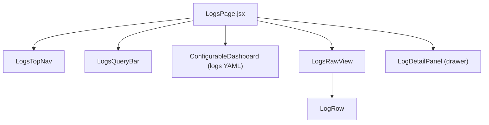
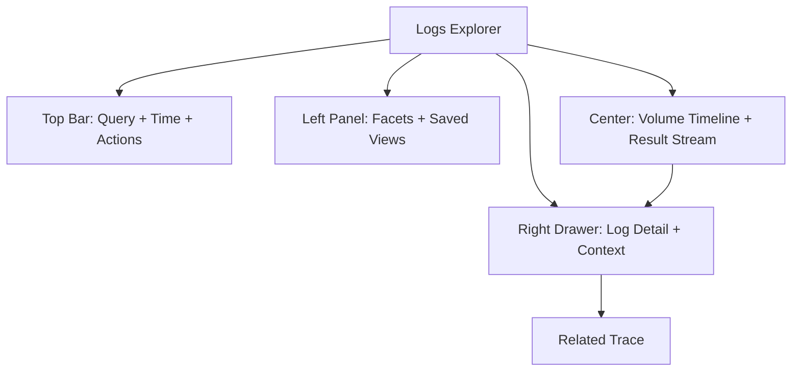
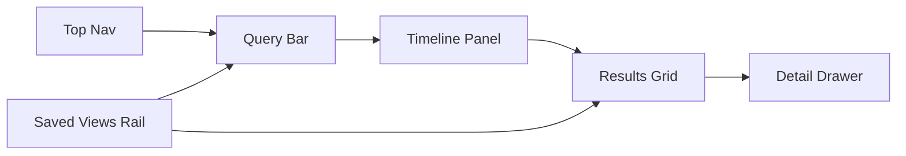

# Product Requirements Document (PRD)

## Logs Page Enhancement

- Status: Draft
- Date: 2026-02-26
- Owner: Product + Observability Team
- Audience: Design, Frontend, Backend, QA
- Target Release: Phased rollout (Phase 1 in 6 weeks)
- Frontend Reference Repo: `/Users/ramantayal/Project/observability-frontend`

## 1. Summary

The current Logs page surfaces basic log volume trends, but it is not yet a full investigation workspace for on-call debugging. This PRD defines a complete Logs Explorer experience with faster filtering, richer context, trace correlation, and collaboration features.

The goal is to move the page from "chart + raw rows" to "investigation cockpit" while reusing existing backend endpoints where possible.

## 2. Problem Statement

Teams need to answer questions quickly during incidents:

- What changed in the last 10-15 minutes?
- Which service/host/pod is emitting errors?
- What happened immediately before and after this event?
- Is this log connected to a trace/span and request path?

Current experience gaps:

- Limited search ergonomics for complex investigations.
- Weak context switching between chart, list, and detail views.
- No native saved views/workflows for recurring investigations.
- Limited collaboration handoff (shareable query state, export, bookmarks).

## 3. Goals and Success Metrics

### Product goals

- Reduce time-to-first-useful-result for incident triage.
- Increase confidence in root-cause analysis from logs alone.
- Improve cross-signal correlation (logs -> traces).

### Success metrics (90 days after GA)

- Median time from page load to first filter action: < 20 seconds.
- Median time to isolate target service during incident drills: -30%.
- Logs page weekly active users: +25%.
- Saved views created per active team per month: >= 3.
- Error investigation completion rate (internal dogfood task): +20%.

## 4. Users and Jobs-To-Be-Done

- On-call engineer: "During a spike, show me only relevant error logs and context fast."
- SRE/platform engineer: "Identify noisy services, pods, and hosts over time."
- Backend engineer: "Start from a trace ID and inspect related logs quickly."

## 5. Current State Baseline

Current backend support already available in this repo:

- `GET /v1/logs` (filters, pagination cursor, sorting direction)
- `GET /v1/logs/histogram`
- `GET /v1/logs/volume`
- `GET /v1/logs/stats`
- `GET /v1/logs/fields`
- `GET /v1/logs/surrounding`
- `GET /v1/logs/detail`
- `GET /v1/traces/:traceId/logs`

Current filter dimensions available:

- Level, service, host, pod, container, logger
- Trace ID, span ID
- Text search (`message` and `exception`)
- Include and exclude filtering for key fields

### 5.1 Current frontend baseline (from `observability-frontend`)

Current route and page shell:

- Route: `/logs` in `src/App.jsx`
- Hub wrapper: `src/pages/LogsHubPage.jsx`
- Main page: `src/pages/LogsPage.jsx`

Current logs frontend component map:



Current UI/token baseline already implemented:

- Global theme tokens in `src/index.css` (`--bg-*`, `--text-*`, `--color-*`).
- Log level color map in `src/config/constants.js` (`LOG_LEVELS`).
- Logs-specific styling in `src/pages/LogsPage.css` (query pills, table, drawer, histogram panel).
- Data fetching model in `src/hooks/useInfiniteLogs.js` (cursor pagination, dedup, live polling).

Current UX strengths:

- Structured query pills (`field -> operator -> value`) in `LogsQueryBar`.
- Column resize + show/hide + client-side export in `LogsRawView`.
- Slide-in detail drawer with trace deep-link in `LogRow/LogDetailPanel`.
- Histogram integration through dashboard config (`useDashboardConfig('logs')`).

Current UX gaps against target:

- No saved views UX.
- No shareable URL state management for all filters/query.
- No first-class facet sidebar wired to `/v1/logs/stats` and `/v1/logs/fields`.
- Limited mobile behavior definition for dense table interactions.
- Live tail is polling-based toggle, not true stream mode with flow controls.

## 6. Scope

### In scope (Phase 1)

- New Logs Explorer page IA and layout.
- Query bar + filter chips + time controls.
- Log volume visualization linked to result list.
- Virtualized results table with quick actions.
- Detail drawer with surrounding context and correlation links.
- Saved views and shareable URLs.
- Empty/error/loading states and accessibility baseline.

### In scope (Phase 2)

- Live tail mode.
- Query pattern clustering and noise suppression.
- Export and investigation handoff artifacts.

### Out of scope (this PRD cycle)

- Full SIEM rule engine.
- Long-term log archival policy redesign.
- Agent-side ingestion pipeline changes.

## 7. Experience Design

### 7.1 Information architecture



### 7.2 Desktop wireframe (low fidelity)

```text
+------------------------------------------------------------------------------------------------------+
| Logs Explorer          [Env: prod] [Last 15m v] [Refresh 10s v]            [Save View] [Share]     |
| Query: service:payments level:error "timeout"                              [Run] [Clear]            |
+-------------------------------+---------------------------------------------------------------------+
| FACETS                        | LOG VOLUME TIMELINE                                                  |
| - Level (ERROR 240)           | stacked bars by level + anomaly markers + brush window              |
| - Service (payments 180)      +---------------------------------------------------------------------+
| - Host (node-7 90)            | RESULTS (virtualized stream/table)                                  |
| - Pod, Container, Logger      | Time        Level   Service     Message                    Trace     |
|                               | 12:40:11    ERROR   payments    timeout calling bank API   9f2...   |
| Saved Views                   | 12:40:10    WARN    gateway     upstream slow              -        |
| - Payment incident baseline   | ...                                                                 |
+-------------------------------+---------------------------------------------------------------------+
| Detail Drawer (on row click): message, attributes JSON, before/after logs, open trace, copy link   |
+------------------------------------------------------------------------------------------------------+
```

### 7.3 Mobile wireframe (low fidelity)

```text
+---------------------------------------------------------+
| Logs [15m v] [Filter]                                   |
| Query...                                      [Run]     |
+---------------------------------------------------------+
| Volume chart (compact)                                  |
+---------------------------------------------------------+
| 12:40:11 ERROR payments timeout calling bank API >      |
| 12:40:10 WARN  gateway upstream slow >                  |
| 12:40:08 INFO  auth login success >                     |
+---------------------------------------------------------+
| Row detail sheet: attributes, context, trace link       |
+---------------------------------------------------------+
```

### 7.4 Visual design direction

- Tone: high-signal operator console (clear hierarchy, low noise).
- Palette: neutral base, severity-led accents (error/warn/info/debug).
- Typography: dense but readable for high-volume scanning.
- Motion: subtle only where it improves orientation (drawer open, chart brush).
- Density controls: compact/cozy row modes for different workflows.

### 7.5 Frontend design specification (repo-aligned)

#### 7.5.1 Screen architecture (target)



#### 7.5.2 Component mapping (reference -> target)

| Area | Reference file(s) in frontend repo | Target enhancement |
| --- | --- | --- |
| Page shell | `src/pages/LogsHubPage.jsx`, `src/pages/LogsPage.jsx` | Keep shell, add left saved-views/facets rail and responsive collapse behavior. |
| Top navigation | `src/components/logs/LogsTopNav.jsx` | Add time preset picker, refresh control, save/share actions, keyboard shortcut menu. |
| Query experience | `src/components/logs/LogsQueryBar.jsx` | Keep structured pills; add token autocomplete from `/v1/logs/fields`, syntax validation, recent queries. |
| Timeline | `src/components/charts/LogHistogram.jsx`, logs dashboard config | Keep histogram visuals; add brush-to-filter and level toggles with URL-synced state. |
| Results | `src/components/logs/LogsRawView.jsx`, `LogRow.jsx` | Keep resizable columns; add virtualization, sticky key columns, row action menu. |
| Detail context | `LogRow.jsx` (`LogDetailPanel`) | Keep drawer; add tabs for surrounding logs (`/v1/logs/surrounding`) and correlated trace/log context. |
| Data orchestration | `src/hooks/useInfiniteLogs.js`, `src/services/v1Service.js` | Extend for saved views, share links, server export jobs, streaming live tail mode. |

#### 7.5.3 Frontend visual tokens (must align with existing theme system)

- Use existing CSS variables from `src/index.css` as source of truth.
- Keep severity palette aligned with `LOG_LEVELS` in `src/config/constants.js`.
- Maintain mono typography for log rows (`JetBrains Mono`/`Fira Code`) and sans-serif for controls.
- Preserve dark/light compatibility using `[data-theme="light"]` variable overrides.

#### 7.5.4 Desktop layout specification

| Region | Spec |
| --- | --- |
| Top Nav | Height 48-56px; left = title/context, right = live mode, time range, save/share actions. |
| Query Bar | Persistent row below top nav; supports pills wrapping to second line without layout shift. |
| Left Rail | 260px desktop width; contains saved views, facets, active filters; collapsible section groups. |
| Timeline Panel | 80-140px chart height; stacked level bars; click/drag sets active time window. |
| Results Grid | Dominant area; sticky header; infinite loading; row density toggle (`comfortable`/`compact`). |
| Detail Drawer | 480px docked right (existing pattern) with slide-in animation and keyboard close (`Esc`). |

#### 7.5.5 Mobile/tablet layout specification

| Breakpoint | Behavior |
| --- | --- |
| `> 1200px` | Full desktop layout with left rail + right drawer. |
| `768px - 1200px` | Left rail collapses to filter button + flyout; drawer becomes wider bottom sheet if needed. |
| `< 768px` | Query bar and chart remain top; results become single-column list cards; detail opens full-screen sheet; column-resize UI hidden. |

#### 7.5.6 Key interaction patterns

- Query composition:
  - Keep 3-step filter builder (field/operator/value) from current `LogsQueryBar`.
  - Press `Enter` to commit token, `Backspace` to step back, `Esc` to close builder.
- Investigation flow:
  - Click chart bucket or brush range -> updates time window -> refetch results and facets.
  - Click row -> open detail drawer -> quick actions (`copy`, `include`, `exclude`, `view trace`).
- Load behavior:
  - Keep cursor-based pagination model from `useInfiniteLogs`.
  - Add virtualization to avoid long DOM growth during extended sessions.
- Live mode:
  - Replace polling-only mode with stream transport in Phase 2, with pause/resume and overflow indicator.

## 8. Functional Requirements

| ID | Requirement | Priority | Acceptance criteria |
| --- | --- | --- | --- |
| FR-01 | Structured query bar with free-text fallback | P0 | User can filter by fields (`service`, `level`, `host`, `pod`, `traceId`, `spanId`) and free text in one query. Invalid tokens show inline validation. |
| FR-02 | Time range + auto refresh controls | P0 | User can choose presets (`5m`, `15m`, `1h`, `24h`) and custom range. Auto refresh can be off or set intervals. |
| FR-03 | Faceted filtering with include/exclude | P0 | Sidebar shows top facet values with counts and supports include/exclude chips reflected in URL state. |
| FR-04 | Linked volume chart | P0 | Chart updates with current filters/time range and brushing time window updates results instantly. |
| FR-05 | Virtualized result list/table | P0 | List handles 10k+ logical rows via cursor pagination without browser slowdown; sticky columns for time/level/service. |
| FR-06 | Row quick actions | P0 | For each row user can copy message, copy JSON, add include/exclude filter, open detail drawer. |
| FR-07 | Detail drawer with context | P0 | Drawer shows full record, parsed attributes, surrounding logs (`before/after`), and trace jump when IDs exist. |
| FR-08 | Correlation to trace view | P0 | When `traceId` exists, user can open related trace with preserved time/query context. |
| FR-09 | Saved views + share link | P1 | User can save query/filter/time preset as named view and share a URL that recreates state. |
| FR-10 | Live tail mode | P1 | User can enable streaming mode with pause/resume and backpressure handling for high-volume streams. |
| FR-11 | Pattern clustering | P2 | Similar log lines can be grouped with counts to reduce noise during high-cardinality incidents. |
| FR-12 | Export results | P2 | User can export filtered results (CSV/JSON) with audit-safe limits and async status for large exports. |
| FR-13 | Frontend component parity with existing repo patterns | P0 | New logs UX is implemented by extending existing logs components/hooks (not parallel duplicate page), preserving theme and shared layout conventions. |
| FR-14 | Responsive logs UX | P0 | Logs page is fully usable at `<768px`, `768-1200px`, and `>1200px` with documented behavior for filters, table/list, and detail panel. |
| FR-15 | URL state serialization | P1 | Query, filters, time range, selected view, and sort state serialize into URL and restore on refresh/share. |
| FR-16 | Facet rail integration | P1 | Frontend consumes `/v1/logs/stats` and `/v1/logs/fields` to render facet counts and field value suggestions with loading/error handling. |
| FR-17 | Virtualized rendering | P1 | Results rendering remains smooth (60fps scroll target on modern laptops) for large result sets with continuous pagination. |
| FR-18 | Design-token compliance | P1 | Logs components use global theme tokens and pass dark/light snapshots in visual QA checks. |

## 9. Backend and API Requirements

### 9.1 Reuse existing endpoints

- `/v1/logs` for primary result stream.
- `/v1/logs/stats` and `/v1/logs/fields` for facets and autocomplete values.
- `/v1/logs/volume` and `/v1/logs/histogram` for timeline visualizations.
- `/v1/logs/surrounding` and `/v1/logs/detail` for contextual drilldown.
- `/v1/traces/:traceId/logs` for trace correlation flows.

### 9.2 New endpoints needed

- `POST /v1/logs/saved-views`
- `GET /v1/logs/saved-views`
- `PUT /v1/logs/saved-views/:id`
- `DELETE /v1/logs/saved-views/:id`
- `GET /v1/logs/tail` (SSE/WebSocket for live mode)
- `POST /v1/logs/export` and `GET /v1/logs/export/:jobId`
- `GET /v1/logs/patterns` (optional phase 2)

### 9.3 Data model additions

- `saved_log_views` table in relational DB:
  - `id`, `team_id`, `user_id`, `name`, `query`, `filters_json`, `time_preset`, `created_at`, `updated_at`
- `log_export_jobs` table:
  - `id`, `team_id`, `requested_by`, `status`, `params_json`, `file_url`, `expires_at`, `created_at`

## 10. Non-Functional Requirements

- Performance:
  - P95 initial load (15m range) <= 2.5s.
  - P95 filter-to-render update <= 1.2s.
  - P99 API errors for logs query <= 1%.
- Reliability:
  - Graceful degradation when one panel fails (chart/list independent retries).
- Security:
  - Team isolation enforced on all queries.
  - Saved views and exports respect RBAC.
- Accessibility:
  - Keyboard navigable filters/list/drawer.
  - WCAG AA contrast for severity colors.

## 11. Instrumentation and Analytics

Track events:

- `logs_page_viewed`
- `logs_query_executed`
- `logs_facet_applied`
- `logs_row_opened`
- `logs_trace_opened`
- `logs_view_saved`
- `logs_export_requested`
- `logs_tail_started` / `logs_tail_stopped`

Key dashboards:

- Query latency by range preset.
- No-result query rate.
- Top filters used.
- Saved view retention (7-day, 30-day).

## 12. Rollout Plan

### Phase 0 (Week 1-2)

- Finalize UX spec and API contracts.
- Build feature flags and baseline instrumentation.

### Phase 1 (Week 3-6)

- Ship core explorer (FR-01 to FR-08).
- Dogfood with internal on-call rotation.

### Phase 2 (Week 7-9)

- Ship saved views and sharing (FR-09).
- Ship live tail beta (FR-10).

### Phase 3 (Week 10+)

- Pattern clustering and export (FR-11, FR-12).
- Hardening and optimization based on production metrics.

## 13. Risks and Mitigations

- High-cardinality fields can overload facet queries.
  - Mitigation: capped facet values, async field suggestions, index tuning.
- Live tail can create costly backend fan-out.
  - Mitigation: connection quotas, sampling, bounded buffers.
- Query complexity can hurt UX clarity.
  - Mitigation: dual mode (simple chips + advanced syntax), inline examples.

## 14. Open Questions

- Should saved views be personal-only or team-shared by default?
- Do we need comment annotations on saved views for handoff?
- What export retention period satisfies compliance requirements?
- Should pattern clustering be deterministic server-side or client-assisted?

## 15. Launch Readiness Checklist

- Design QA complete on desktop and mobile breakpoints.
- API and schema changes reviewed and load tested.
- Feature flag + rollback path validated.
- Observability dashboards and alerts configured.
- Documentation and support playbook published.
